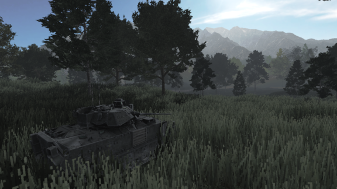
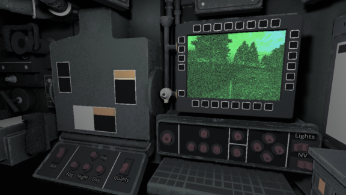

### Bradley Simulator

A simplified simulator of a military vehicle M2A2 'Bradley' created for a university course. Made by a team of 4 people in the Godot game engine.

---

### Showcase

---

### Functionalities

- Tank - `golub`
	- [x] model
	- [x] simple simulation
	- [x] animation of tracks and wheels
	- [x] turret control
- Terrain - `golub`
	- [x] relief/landscape
	- [x] trees
	- [x] grass
	- [x] LOD
- UI - `golub`
	- [x] targeting monitor/sight
	- [x] movement control panel/dashboard
	- [x] simulation settings control panel
- Environment - `golub`
	- [x] day
	- [x] night
	- [x] fog
- Audio effects - `vito`
    - [ ] turret fire (near/far)
    - [ ] explosion (near/far)
	- [ ] ...
- Visual effects - `antonio`
	- [ ] gun smoke/muzzle flash
	- [ ] bullet/shell explosion
	- [ ] vehicle explosion
	- [ ] ...
- Enemy specialist - `grga`, `vito`
	- [ ] model
	- [ ] automatic target acquisition/aiming
	- [ ] inaccurate aiming (spread)
	- [ ] AI movement
    - [ ] Enemy distribution - `antonio`
- Projectiles & health system - `antonio`
	- [ ] projectile (spawning, trajectory, hit)
	- [ ] health (health points, death explosion)
- Advanced movement (vibe coding) - `grga`
- Documentation - `???`

---

### Team roles

    <table>
        <tr>
            <th>Category</th>
            <th>Description</th>
            <th>Option</th>
            <th>Assigned</th>
            <th>State</th>
        </tr>
        <tr>
            <td>1. 3D terrain</td>
            <td>
                <ol type="a">
                    <li>Simple plane</li>
                    <li>3D height map/triangle mesh</li>
                    <li>3D height map/triangle mesh with textures, miscellaneous objects  (buildings, trees, billboards…)</li>
                </ol>
                <em>
                    (Pay attention to the sufficient terrain size to cover at least a few hundred meters and up to a couple kilometers, which is within effective firing range of various tank guns)
                </em>
            </td>
            <td><kbd>c)</kbd></td>
            <td>golub</td>
            <td><kbd>Done</kbd></td>
        </tr>
        <tr>
            <td>2. 3D armored vehicle/tank</td>
            <td>
                <ol type="a">
                    <li>Sphere/Box</li>
                    <li>Simple model – boxes and cylinders</li>
                    <li>Imported 3D model</li>
                    <li>Personally designed 3D model</li>
                </ol>
            </td>
            <td><kbd>c)</kbd></td>
            <td>golub</td>
            <td><kbd>Done</kbd></td>
        </tr>
        <tr>
            <td>3. 3D targets</td>
            <td>
                <ol type="a">
                    <li>Sphere/Box</li>
                    <li>Simple model – boxes and cylinders</li>
                    <li>Imported 3D model</li>
                    <li>Personally designed 3D model</li>
                </ol>
                <em>(other armored vehicles/tanks)</em>
            </td>
            <td><kbd>c)</kbd></td>
            <td>cuic, grga</td>
            <td><kbd>Unfinished</kbd></td>
        </tr>
        <tr>
            <td>4. Armored vehicle/tank simulation on the terrain</td>
            <td>
                <ol type="a">
                    <li>Simultaneous coupled manual control of the motion and aiming (e.g. keyboard w-s for turn left-right, space for engine thrust) </li>
                    <li>Separate manual control of the motion vs. aiming (e.g. keyboard for motion, mouse for aiming)</li>
                    <li>...</li>
                    <li>Dynamics model using differential equations derived from forces and/or moments, but which is easily controllable by keyboard and mouse – some team member should work this out with their favorite Large Language Model (save and attach all discussions). 
                        <em>
                            <ul>
                                <li>One potential option to consider in trying to minimize complexity is to ask LLM to use forces and corresponding differential equations, but not to use moments, and instead of using moments, to have rotation angles (attitude of the object) controlled directly by the keyboard or mouse. </li>
                                <li>This model should output the same information as the model under option a, ... (for example, x, y, z, and 3 angles of rotation) – in this way, models can easily be switched in the simulation.</li>
                            </ul>
                        </em>
                    </li>
                </ol>
                <em>(any one of a, b, … + mandatory d)</em>
            </td>
            <td><kbd>b)</kbd> <kbd>d)</kbd></td>
            <td>golub  grga</td>
            <td><kbd>Done</kbd>   <kbd>Unfinished</kbd></td>
        </tr>
        <tr>
            <td>5. Target motion simulation</td>
            <td>
                <ol type="a">
                    <li>No motion, static targets</li>
                    <li>a + Linear terrain following motion using approximate speed</li>
                    <li>...</li>
                </ol>
            </td>
            <td><kbd>c)</kbd></td>
            <td>cuic, grga</td>
            <td><kbd>Unfinished</kbd></td>
        </tr>
        <tr>
            <td>6. Simulation of Basic Vehicle Dashboard Instruments</td>
            <td>
                <ol type="a">
                    <li>Overlay of custom basic 3D elements – flattened spheres, elongated cuboids as pointers, etc.</li>
                    <li>Overlay of custom 2D elements – circles, elongated triangles as pointers, etc.</li>
                    <li>Overlay of ready-made 2D elements if a GUI library exists within the development tool</li>
                    <li>Integrated 3D dashboard within the vehicle's 3D model itself</li>
                </ol>
                <em>(at least 2 output instruments and at least 1 input instrument)</em>
            </td>
            <td><kbd>d)</kbd></td>
            <td>golub</td>
            <td><kbd>Done</kbd></td>
        </tr>
        <tr>
            <td>7. Setup of initial parameters of simulation</td>
            <td>
                <ol type="a">
                    <li>No configuration, armored vehicle/tank and targets always at the same positions relative to the terrain </li>
                    <li>Random selection of positions of armored vehicle/tank and targets, while respecting the approximate distance between them</li>
                    <li>Text configuration file </li>
                    <li>Graphical user interface enabling configuration of target and launcher position on a 2D map</li>
                </ol>
            </td>
            <td><kbd>b)</kbd></td>
            <td>zulim</td>
            <td><kbd>Unfinished</kbd></td>
        </tr>
        <tr>
            <td>8. Design of a scenario in line with the requirements of the topic as presented on the slides during introduction of seminar topics</td>
            <td>
                <ol type="a">
                    <li>Visual explosion effects in the sphere around the armored vehicle</li>
                    <li>Same as a</li>
                    <li>b + Audio explosion effects in the sphere around the armored vehicle</li>
                    <li>c + Effects for camera shake / visibility changes, etc.</li>
                </ol>
                <em>(first, regular situations (targets that don’t return fire), then emergency/stressful situations (targets that return fire))</em>
            </td>
            <td><kbd>d)</kbd></td>
            <td>cuic, grga</td>
            <td><kbd>Unfinished</kbd></td>
        </tr>
        <tr>
            <td>9. Reaction of the targets to being hit</td>
            <td>
                <ol type="a">
                    <li>If the target was moving it stops when hit</li>
                    <li>Target disappears</li>
                    <li>Target is blown up, i.e. disappears after its own explosion</li>
                    <li>Target is pushed and partially damaged, or fully blown up, depending on the impact position</li>
                </ol>
            </td>
            <td><kbd>d)</kbd></td>
            <td>cuic, grga</td>
            <td><kbd>Unfinished</kbd></td>
        </tr>
        <tr>
            <td>10. Tank gun round on-firing and on-impact visual effects</td>
            <td>
                <ol type="a">
                    <li>No effects</li>
                    <li>Effects at the time of firing and/or on impact against the target</li>
                    <li>b + Effects on impact against the terrain</li>
                    <li>b + c + Effects on impact against other miscellaneous objects on the terrain</li>
                </ol>
            </td>
            <td><kbd>c)</kbd></td>
            <td>zulim</td>
            <td><kbd>Unfinished</kbd></td>
        </tr>
        <tr>
            <td>11. Audio simulation</td>
            <td>
                <ol type="a">
                    <li>No sounds</li>
                    <li>Sound effects of vehicle engine, gun round firing and explosion upon impact</li>
                    <li>b + Additional generic battleground sounds</li>
                </ol>
            </td>
            <td><kbd>b)</kbd></td>
            <td>cuic</td>
            <td><kbd>Unfinished</kbd></td>
        </tr>
        <tr>
            <td>12. Weather conditions</td>
            <td>
                <ol type="a">
                    <li>No configuration</li>
                    <li>Fog density</li>
                    <li>b + Time of day (Sun position) …</li>
                </ol>
            </td>
            <td><kbd>c)</kbd></td>
            <td>golub</td>
            <td><kbd>Done</kbd></td>
        </tr>
        <tr>
            <td>13. Camera selection</td>
            <td>
                <ol type="a">
                    <li>Camera provides driver view of the armored vehicle/tank</li>
                    <li>If separate control of motion and gun aiming, driver camera with independently controllable crosshair marker </li>
                    <li>If separate control of motion and gun aiming, camera for each view (split screen)</li>
                    <li>...</li>
                </ol>
            </td>
            <td><kbd>b)</kbd></td>
            <td>golub</td>
            <td><kbd>Done</kbd></td>
        </tr>
        <tr>
            <td>14. Replay capabilities</td>
            <td>
                <ol type="a">
                    <li>None</li>
                    <li>Can replay the last executed simulation</li>
                </ol>
            </td>
            <td><kbd>a)</kbd></td>
            <td>-</td>
            <td><kbd>Done</kbd></td>
        </tr>
        <tr>
            <td>15. Documentation</td>
            <td>
                <ul>
                    <li>examples of existing simulators</li>
                    <li>list of LLM prompts for category 4</li>
                    <li>...</li>
                </ul>
            </td>
            <td><kbd>-</kbd></td>
            <td></td>
            <td><kbd>Unfinished</kbd></td>
        </tr>
    </table>

---

### References

>Research
> - Wiki: https://en.wikipedia.org/wiki/M2_Bradley
> - Promo: https://youtu.be/xqDgn-qXr0E
> - Design: https://youtu.be/gNHnC81K7EA
> - Bradleycoft: https://www.oasis-ae.com/bradleycoft
> - Interior: https://www.turbosquid.com/3d-models/m2-bradley-ifv-with-full-interior-3d-model-2089580
> - Interior: [https://en.defence-ua.com/weapon_and_tech/](https://en.defence-ua.com/weapon_and_tech/what_does_m2a2_bradley_look_like_from_inside_analyzing_ukraines_new_combat_vehicle_photo-5382.html)

>Assets
> - Terrain3D addon (MIT License): https://terrain3d.readthedocs.io/en/latest/index.html
> - Bradley model (CC BY-NC 4.0): https://sketchfab.com/3d-models/ba-m2a2-bradley-8d6d1208a6c4469db6d52628d610552e
> - Textures (free): https://www.cgbookcase.com/
> - Textures (free): https://freepbr.com/
> - Tree models (Free Standard): https://sketchfab.com/3d-models/coniferous-forest-assets-pack-240ce9cf0ad3474f809a59f9446e63cd
> - Tree models (Free Standard): https://sketchfab.com/3d-models/various-forest-assets-pack-cf138b8eb2d340cda643ed59f824989c
> - Grass texture (CC BY 4.0): https://sketchfab.com/3d-models/grass-pack-lp-3352f9d646ec4f25b8aeb28e4232814a
> - General post processing shader (MIT License): https://github.com/ArseniyMirniy/Godot-4-Color-Correction-and-Screen-Effects
> - Night vision shader (MIT License): https://github.com/robertcorponoi/godot-night-vision-screen-shaders

---

